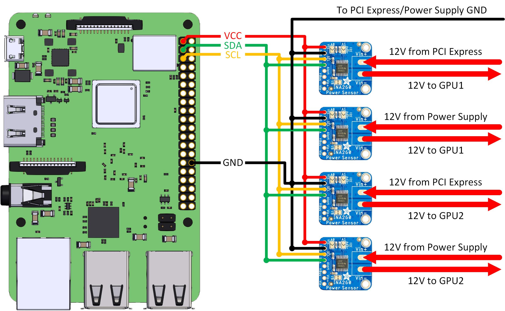

# GPU Power Monitoring
This project aims to implement fast GPU power monitoring system using INA260 sensors connected to a Raspberry Pi 3

## Connection
Four INA260 are used to measure two GPU powers simultaneously


## Changeing Raspberry i2c Speed

In order to achieve higher i2c speed, it is required to change the default i2c speed of Raspberry Pi from 100Mbp to 2Mbps
1. Open /boot/config.txt file
```
sudo nano /boot/config.txt
```

2. Find the line Find the line containing ```/boot/config.txt``` and add ```,i2c_arm_baudrate=2900000``` to the end of the line. Also add ```force_turbo=1``` line to the file. The resut would become like the following
```
...
force_turbo=1
# Uncomment some or all of these to enable the optional hardware interfaces
dtparam=i2c_arm=on,i2c_arm_baudrate=1200000
...
```
3. reboot the Raspberry Pi
```
sudo reboot
```
4. Verify if the changed are applied
```
bash i2cspeed.sh
```


